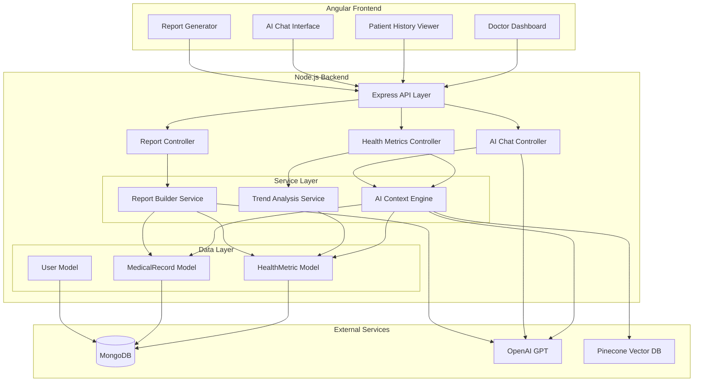

# Design Document: AI Healthcare Enhancements

## Overview

This design enhances an existing healthcare platform with comprehensive AI capabilities across three key areas: patient history access, AI assistant intelligence, and consultation report generation. The platform uses a Node.js/Express backend with MongoDB, integrated with OpenAI for language models, LangChain for orchestration, and Pinecone for vector storage.

The enhancements focus on:
1. **Comprehensive Patient History Viewer** - Doctors can access complete health metrics including blood levels, sugar levels, and medical history with visual indicators and filtering
2. **AI Context Engine** - The AI assistant gains access to patient-specific health data for contextually relevant medical guidance
3. **Enhanced Report Generation** - Consultation reports include AI insights, health trends, and patient history in professional PDF format

### Key Design Decisions

- **Extend existing HealthMetric model** rather than create new schemas - the current model supports flexible metric types
- **Leverage existing RAG infrastructure** (Pinecone + LangChain) for AI context enhancement
- **Build on existing PDF generation** (PDFKit) for report improvements
- **Maintain backward compatibility** with existing API endpoints while adding new capabilities
- **Prioritize data privacy** - patient data only accessible to authorized doctors during active consultations

## Architecture

### System Components



### Data Flow

#### Patient History Access Flow
1. Doctor selects patient from dashboard
2. Frontend requests patient history via `/api/metrics/patient/:patientId/history`
3. Backend retrieves all health metrics filtered by patient ID
4. Backend applies date range and metric type filters
5. Backend identifies out-of-range values using clinical thresholds
6. Frontend displays organized, color-coded history with visual indicators

#### AI Context Enhancement Flow
1. Doctor initiates consultation with patient
2. AI Context Engine loads patient's recent health metrics (last 10 blood levels, 10 sugar levels)
3. Engine loads relevant medical history from past 12 months
4. Engine formats data into structured context suitable for AI processing
5. Context is injected into AI system prompt before each query
6. AI assistant references patient-specific data in responses

#### Enhanced Report Generation Flow
1. Doctor completes consultation and requests report
2. Report Builder collects consultation data (symptoms, diagnoses, AI insights)
3. Builder retrieves relevant health metrics from consultation period
4. Builder requests AI-generated summaries (technical and plain-language)
5. Builder compiles all data into structured PDF using PDFKit
6. PDF is streamed to frontend for download

## Components and Interfaces

### 1. AI Context Engine Service

**Purpose**: Provides patient-specific context to the AI assistant for personalized medical guidance.

**Location**: `backend/src/services/aiContext.service.js`

**Key Functions**:

```javascript
/**
 * Builds AI context from patient health data
 * @param {string} patientId - Patient's MongoDB ObjectId
 * @param {Object} options - Context options (timeRange, maxRecords)
 * @returns {Promise<Object>} Formatted context object
 */
async function buildPatientContext(patientId, options = {})

/**
 * Formats health metrics for AI consumption
 * @param {Array} metrics - Array of HealthMetric documents
 * @returns {string} Formatted text suitable for AI prompt
 */
function formatMetricsForAI(metrics)

/**
 * Prioritizes data when context exceeds limits
 * @param {Object} contextData - Full context data
 * @param {number} maxTokens - Maximum token limit
 * @returns {Object} Prioritized context data
 */
function prioritizeContext(contextData, maxTokens)
```

**Context Structure**:
```javascript
{
  patientId: "507f1f77bcf86cd799439011",
  demographics: {
    age: 45,
    gender: "male"
  },
  recentMetrics: {
    bloodLevels: [
      { type: "hemoglobin", value: 14.5, unit: "g/dL", date: "2024-01-15" },
      // ... up to 10 most recent
    ],
    sugarLevels: [
      { type: "fasting", value: 105, unit: "mg/dL", date: "2024-01-14" },
      // ... up to 10 most recent
    ],
    otherMetrics: [
      { type: "blood_pressure", value: 130, value2: 85, unit: "mmHg", date: "2024-01-15" }
    ]
  },
  medicalHistory: [
    { date: "2023-12-01", type: "diagnosis", title: "Type 2 Diabetes", doctor: "Dr. Smith" }
    // ... entries from past 12 months
  ],
  clinicalFlags: [
    { metric: "blood_sugar", status: "elevated", value: 105, normalRange: "70-100" }
  ]
}
```

### 2. Trend Analysis Service

**Purpose**: Analyzes health metric trends to identify patterns and generate alerts.

**Location**: `backend/src/services/trendAnalysis.service.js`

**Key Functions**:

```javascript
/**
 * Analyzes trends for a specific metric type
 * @param {string} patientId - Patient's MongoDB ObjectId
 * @param {string} metricType - Type of metric (blood_sugar, blood_pressure, etc.)
 * @param {number} months - Number of months to analyze (default: 6)
 * @returns {Promise<Object>} Trend analysis result
 */
async function analyzeTrend(patientId, metricType, months = 6)

/**
 * Identifies correlations between different metrics
 * @param {string} patientId - Patient's MongoDB ObjectId
 * @param {Array<string>} metricTypes - Metric types to correlate
 * @returns {Promise<Array>} Correlation findings
 */
async function findCorrelations(patientId, metricTypes)

/**
 * Generates clinical alerts based on trends
 * @param {Object} trendData - Trend analysis results
 * @returns {Array} Array of alert objects
 */
function generateAlerts(trendData)
```

**Trend Analysis Output**:
```javascript
{
  metricType: "blood_sugar",
  period: "6 months",
  dataPoints: 45,
  trend: "increasing", // "increasing", "decreasing", "stable"
  trendStrength: 0.75, // 0-1 correlation coefficient
  averageValue: 110,
  minValue: 85,
  maxValue: 145,
  recentAverage: 120, // last 30 days
  previousAverage: 100, // previous 30 days
  changePercent: 20,
  clinicalSignificance: "high", // "high", "medium", "low"
  alert: {
    level: "medium",
    message: "Blood sugar trending upward over 6 months",
    recommendation: "Consider HbA1c test and dietary review"
  }
}
```

### 3. Report Builder Service

**Purpose**: Generates comprehensive consultation reports with AI insights and patient data.

**Location**: `backend/src/services/reportBuilder.service.js`

**Key Functions**:

```javascript
/**
 * Generates complete consultation report
 * @param {Object} consultationData - Consultation details
 * @param {string} patientId - Patient's MongoDB ObjectId
 * @param {Object} options - Report options (sections, format)
 * @returns {Promise<Buffer>} PDF buffer
 */
async function generateConsultationReport(consultationData, patientId, options = {})

/**
 * Requests AI-generated summaries
 * @param {Object} consultationData - Consultation details
 * @param {string} audienceType - "patient" or "provider"
 * @returns {Promise<string>} AI-generated summary
 */
async function generateAISummary(consultationData, audienceType)

/**
 * Formats health metrics for report tables
 * @param {Array} metrics - Health metric documents
 * @returns {Array} Formatted table data
 */
function formatMetricsForReport(metrics)
```

### 4. Enhanced Health Metrics Controller

**Purpose**: Extends existing controller with patient history and trend analysis endpoints.

**Location**: `backend/src/controllers/health-metric.controller.js` (extend existing)

**New Endpoints**:

```javascript
// GET /api/metrics/patient/:patientId/history
// Returns comprehensive patient history with filtering
exports.getPatientHistory = async (req, res)

// GET /api/metrics/patient/:patientId/trends
// Returns trend analysis for specified metrics
exports.getPatientTrends = async (req, res)

// GET /api/metrics/patient/:patientId/summary
// Returns latest readings with risk assessment
exports.getPatientSummary = async (req, res)
```

### 5. Enhanced Chat Controller

**Purpose**: Integrates patient context into AI chat responses.

**Location**: `backend/src/controllers/chat.controller.js` (extend existing)

**Modified Functions**:

```javascript
// POST /api/chat/conversations/:id/messages
// Enhanced to include patient context when in consultation mode
exports.sendMessage = async (req, res) => {
  // ... existing code ...
  
  // NEW: If consultation context provided, load patient data
  if (req.body.consultationContext) {
    const patientContext = await aiContextService.buildPatientContext(
      req.body.consultationContext.patientId
    );
    // Inject into AI system prompt
  }
  
  // ... continue with existing AI call ...
}
```

## Data Models

### Extended HealthMetric Model

The existing `HealthMetric` model already supports the required functionality. We'll extend it with additional metric types and validation:

**Location**: `backend/src/models/HealthMetric.js` (extend existing)

**New Metric Types**:
```javascript
type: { 
  type: String, 
  enum: [
    // Existing types
    'blood_pressure', 'heart_rate', 'weight', 'blood_sugar', 
    'temperature', 'oxygen', 'steps',
    // NEW: Blood level types
    'hemoglobin', 'white_blood_cells', 'platelets', 'red_blood_cells',
    'hematocrit', 'mcv', 'mch', 'mchc',
    // NEW: Sugar level types  
    'fasting_glucose', 'postprandial_glucose', 'hba1c', 'random_glucose',
    // NEW: Other common metrics
    'cholesterol_total', 'ldl', 'hdl', 'triglycerides',
    'creatinine', 'bun', 'alt', 'ast'
  ], 
  required: true 
}
```

**Clinical Range Definitions** (new utility):

**Location**: `backend/src/utils/clinicalRanges.js` (new file)

```javascript
const CLINICAL_RANGES = {
  hemoglobin: {
    male: { min: 13.5, max: 17.5, unit: 'g/dL' },
    female: { min: 12.0, max: 15.5, unit: 'g/dL' }
  },
  fasting_glucose: {
    normal: { min: 70, max: 100, unit: 'mg/dL' },
    prediabetes: { min: 100, max: 125, unit: 'mg/dL' },
    diabetes: { min: 126, max: null, unit: 'mg/dL' }
  },
  blood_pressure: {
    systolic: {
      normal: { min: 90, max: 120, unit: 'mmHg' },
      elevated: { min: 120, max: 129, unit: 'mmHg' },
      stage1: { min: 130, max: 139, unit: 'mmHg' },
      stage2: { min: 140, max: 179, unit: 'mmHg' },
      crisis: { min: 180, max: null, unit: 'mmHg' }
    },
    diastolic: {
      normal: { min: 60, max: 80, unit: 'mmHg' },
      stage1: { min: 80, max: 89, unit: 'mmHg' },
      stage2: { min: 90, max: 119, unit: 'mmHg' },
      crisis: { min: 120, max: null, unit: 'mmHg' }
    }
  },
  // ... additional ranges
};

function isOutOfRange(metricType, value, patientGender) {
  // Returns { inRange: boolean, severity: string, message: string }
}

module.exports = { CLINICAL_RANGES, isOutOfRange };
```

### Consultation Context Schema

**Location**: `backend/src/models/ConsultationContext.js` (new file)

```javascript
const consultationContextSchema = new mongoose.Schema({
  consultationId: { type: mongoose.Schema.Types.ObjectId, required: true },
  patientId: { type: mongoose.Schema.Types.ObjectId, ref: 'User', required: true },
  doctorId: { type: mongoose.Schema.Types.ObjectId, ref: 'User', required: true },
  startTime: { type: Date, default: Date.now },
  endTime: { type: Date },
  contextSnapshot: {
    recentMetrics: mongoose.Schema.Types.Mixed,
    medicalHistory: mongoose.Schema.Types.Mixed,
    aiInsights: [String]
  },
  aiInteractions: [{
    timestamp: Date,
    query: String,
    response: String,
    contextUsed: Boolean
  }]
}, { timestamps: true });
```

## Error Handling

### Error Categories

1. **Data Validation Errors** (400)
   - Invalid metric values (non-numeric, missing units)
   - Invalid date ranges
   - Missing required fields

2. **Authorization Errors** (403)
   - Doctor accessing patient data without active consultation
   - Patient accessing another patient's data
   - Unauthorized report generation

3. **Resource Not Found** (404)
   - Patient ID not found
   - Metric type not supported
   - Consultation context not found

4. **External Service Errors** (502/503)
   - OpenAI API failures
   - Pinecone connection issues
   - PDF generation failures

5. **Rate Limiting** (429)
   - AI query rate limits
   - Report generation limits

### Error Response Format

```javascript
{
  error: {
    code: "INVALID_METRIC_VALUE",
    message: "Blood sugar value must be a positive number",
    field: "value",
    details: {
      provided: "abc",
      expected: "number > 0"
    }
  }
}
```

### Error Handling Strategy

- **Graceful Degradation**: If AI services fail, return basic data without AI insights
- **Retry Logic**: Implement exponential backoff for transient external service failures
- **Fallback Responses**: Use cached or default responses when AI is unavailable
- **Audit Logging**: Log all errors with context for debugging and monitoring
- **User-Friendly Messages**: Translate technical errors into actionable user messages

## Testing Strategy

### Dual Testing Approach

This feature requires both unit tests and property-based tests for comprehensive coverage:

- **Unit tests**: Verify specific examples, edge cases, and integration points
- **Property tests**: Verify universal properties across all inputs using randomized testing
- Together: Unit tests catch concrete bugs, property tests verify general correctness

### Property-Based Testing

**Framework**: fast-check (JavaScript property-based testing library)

**Installation**: `npm install --save-dev fast-check`

**Configuration**: Each property test must run minimum 100 iterations to ensure comprehensive input coverage.

**Test Tagging**: Each property test must include a comment tag referencing the design property:
```javascript
// Feature: ai-healthcare-enhancements, Property 1: Health Metric Range Validation
```

**Property Test Coverage**:

1. **Data Validation Properties** (Properties 1, 2, 5, 6, 25)
   - Range validation across all metric types and demographics
   - Filter correctness with random filter combinations
   - Data formatting completeness
   - Patient association preservation (round-trip)
   - Context structure validation

2. **Data Selection and Ordering Properties** (Properties 3, 4, 7)
   - Recent data selection with varying dataset sizes
   - Chronological ordering with random timestamps
   - Time-based filtering with various time windows

3. **Trend Analysis Properties** (Properties 10, 11, 12)
   - Trend classification with synthetic trend data
   - Alert generation for concerning patterns
   - Correlation detection with correlated datasets

4. **Report Generation Properties** (Properties 8, 13, 17, 18, 26)
   - Report completeness with varying consultation data
   - Conditional section inclusion
   - Section selection filtering
   - Note merging
   - Table formatting consistency

5. **AI Safety Properties** (Properties 20, 21, 22, 23, 24)
   - Disclaimer inclusion in all recommendations
   - Emergency detection and refusal
   - Incomplete data acknowledgment
   - Medication warning inclusion
   - Harmful content suppression

6. **Risk Assessment Properties** (Properties 14, 15, 16)
   - Risk score monotonicity
   - Concern identification completeness
   - Anomaly detection accuracy

7. **Citation and Formatting Properties** (Properties 19)
   - Citation formatting consistency

**Example Property Test**:

```javascript
const fc = require('fast-check');
const { isOutOfRange } = require('../utils/clinicalRanges');

// Feature: ai-healthcare-enhancements, Property 1: Health Metric Range Validation
describe('Health Metric Range Validation', () => {
  it('should correctly identify out-of-range values for any metric and demographics', () => {
    fc.assert(
      fc.property(
        fc.constantFrom('hemoglobin', 'fasting_glucose', 'blood_pressure'),
        fc.float({ min: 0, max: 300 }),
        fc.constantFrom('male', 'female'),
        (metricType, value, gender) => {
          const result = isOutOfRange(metricType, value, gender);
          
          // Property: result should have required fields
          expect(result).toHaveProperty('inRange');
          expect(result).toHaveProperty('severity');
          expect(result).toHaveProperty('message');
          
          // Property: severity should be valid
          expect(['normal', 'low', 'medium', 'high', 'emergency'])
            .toContain(result.severity);
          
          // Property: if out of range, message should be non-empty
          if (!result.inRange) {
            expect(result.message.length).toBeGreaterThan(0);
          }
        }
      ),
      { numRuns: 100 }
    );
  });
});
```

### Unit Testing

**Framework**: Jest (already in use based on Node.js ecosystem)

**Test Coverage Areas**:

1. **Data Validation Tests**
   - Specific examples of valid/invalid metric values
   - Edge cases (zero, negative, extremely large values)
   - Missing required fields
   - Invalid data types

2. **Context Formatting Tests**
   - Specific patient data formatting examples
   - Empty data handling
   - Null/undefined field handling

3. **Trend Analysis Tests**
   - Specific trend examples (clear upward, downward, stable)
   - Insufficient data points handling
   - Missing timestamps

4. **Report Generation Tests**
   - Complete consultation report example
   - Minimal data report example
   - Missing optional sections

5. **Error Handling Tests**
   - Invalid input handling
   - Missing data scenarios
   - External service failure handling

### Integration Testing

**Test Scenarios**:

1. **End-to-End Patient History Flow**
   - Doctor requests patient history
   - System retrieves and formats data
   - Frontend displays correctly

2. **AI Context Integration**
   - Patient context loaded during consultation
   - AI responses reference patient data
   - Context updates with new metrics

3. **Report Generation Flow**
   - Complete consultation workflow
   - Report includes all required sections
   - PDF downloads successfully

4. **External Service Integration**
   - OpenAI API calls with patient context
   - Pinecone vector search
   - MongoDB queries with filters

### API Testing

**Tools**: Supertest (for Express API testing)

**Test Coverage**:
- All new endpoints (`/api/metrics/patient/:id/history`, `/api/metrics/patient/:id/trends`)
- Modified endpoints with new parameters
- Authorization and authentication
- Rate limiting behavior
- Error responses

### Performance Testing

**Metrics to Monitor**:
- Patient history retrieval time (target: <500ms for 1000 records)
- AI response time with context (target: <5 seconds)
- Report generation time (target: <3 seconds)
- Trend analysis computation time (target: <2 seconds)

**Load Testing Scenarios**:
- Multiple concurrent patient history requests
- Simultaneous AI queries with context
- Bulk report generation

### Security Testing

**Test Areas**:
- Patient data access authorization
- SQL/NoSQL injection prevention (using mongo-sanitize)
- Rate limiting effectiveness
- Data privacy in AI context
- Secure PDF generation (no code injection)

## Implementation Notes

### Phase 1: Data Layer Enhancement
1. Extend HealthMetric model with new metric types
2. Create clinical ranges utility
3. Add indexes for efficient querying
4. Implement data validation middleware

### Phase 2: Service Layer Development
1. Build AI Context Engine service
2. Implement Trend Analysis service
3. Create Report Builder service
4. Add comprehensive error handling

### Phase 3: API Layer Extension
1. Add new health metrics endpoints
2. Enhance chat controller with context
3. Extend report controller
4. Implement authorization checks

### Phase 4: Frontend Integration
1. Build Patient History Viewer component
2. Enhance AI chat interface with context indicator
3. Add trend visualization charts
4. Implement enhanced report download

### Phase 5: Testing & Optimization
1. Write comprehensive unit tests
2. Perform integration testing
3. Conduct performance optimization
4. Security audit and penetration testing

### Dependencies

**Existing**:
- express: ^4.18.2
- mongoose: ^8.3.4
- openai: ^6.33.0
- @langchain/openai: ^1.4.3
- @pinecone-database/pinecone: ^7.1.0
- pdfkit: ^0.18.0

**New** (if needed):
- chart.js: For trend visualization in reports (optional)
- date-fns: For date manipulation in trend analysis

### Configuration

**Environment Variables** (add to `.env`):
```
# AI Context Configuration
AI_CONTEXT_MAX_TOKENS=2000
AI_CONTEXT_HISTORY_MONTHS=12
AI_CONTEXT_MAX_METRICS=10

# Trend Analysis Configuration
TREND_ANALYSIS_MIN_DATA_POINTS=5
TREND_ANALYSIS_DEFAULT_MONTHS=6

# Report Configuration
REPORT_MAX_CONCURRENT=5
REPORT_TIMEOUT_SECONDS=10
```

### Monitoring and Observability

**Metrics to Track**:
- AI context build time
- Trend analysis computation time
- Report generation success rate
- External service failure rate
- Patient data access patterns

**Logging Strategy**:
- Log all AI context builds with patient ID (anonymized in logs)
- Log trend analysis requests and results
- Log report generation requests
- Log external service errors with retry attempts
- Audit log for patient data access

### Security Considerations

1. **Data Access Control**
   - Verify doctor-patient relationship before exposing data
   - Implement consultation-based access (time-limited)
   - Audit all patient data access

2. **AI Context Privacy**
   - Never log patient-specific health data in plain text
   - Anonymize data in error logs
   - Clear context from memory after consultation

3. **Report Security**
   - Generate reports with unique IDs
   - Implement download expiration
   - No sensitive data in report URLs

4. **Rate Limiting**
   - Limit AI queries per doctor per hour
   - Limit report generation per doctor per day
   - Prevent abuse of patient history endpoints


## Correctness Properties

*A property is a characteristic or behavior that should hold true across all valid executions of a system—essentially, a formal statement about what the system should do. Properties serve as the bridge between human-readable specifications and machine-verifiable correctness guarantees.*

### Property Reflection

After analyzing all acceptance criteria, I identified 30 potential properties. Through reflection, I've consolidated these to eliminate redundancy:

**Consolidated Properties**:
- Properties 1.6, 2.4, and 7.4 all test range validation → Combined into Property 1 (Range Validation)
- Properties 1.7, 2.6 test filtering logic → Combined into Property 2 (Filter Correctness)
- Properties 3.2, 3.3 test data selection → Combined into Property 3 (Recent Data Selection)
- Properties 5.2-5.7 test report content inclusion → Combined into Property 8 (Report Completeness)
- Properties 6.1, 6.2 test trend analysis → Combined into Property 10 (Trend Analysis)

### Property 1: Health Metric Range Validation

*For any* health metric with a defined normal range and patient demographics, the system SHALL correctly identify whether the value is within normal range, and if out of range, SHALL flag it with appropriate severity level.

**Validates: Requirements 1.6, 2.4, 7.4**

### Property 2: Filter Correctness

*For any* set of health metrics and any valid filter criteria (date range, metric type, patient ID), the filtered results SHALL contain only metrics that match all specified filter criteria.

**Validates: Requirements 1.7, 2.6**

### Property 3: Recent Data Selection

*For any* patient with health metric history, when selecting the N most recent measurements of a specific type, the system SHALL return at most N measurements ordered by date descending, with the most recent first.

**Validates: Requirements 3.2, 3.3**

### Property 4: Chronological Ordering

*For any* set of medical history entries with timestamps, when sorted for display, the system SHALL produce a list in reverse chronological order (newest first).

**Validates: Requirements 1.4**

### Property 5: Data Formatting Completeness

*For any* health metric, the formatted output SHALL include the measurement date, value, and unit of measurement as distinct, non-empty fields.

**Validates: Requirements 1.5**

### Property 6: Patient Association Preservation

*For any* health metric saved with a patient identifier, retrieving that metric SHALL return the same patient identifier (round-trip property).

**Validates: Requirements 2.5**

### Property 7: Time-Based History Filtering

*For any* medical history dataset and a time window (e.g., 12 months), the filtered results SHALL include only entries with dates within that time window.

**Validates: Requirements 3.4**

### Property 8: Report Content Completeness

*For any* consultation data containing patient demographics, symptoms, diagnoses, health metrics, AI insights, medications, and follow-up instructions, the generated report structure SHALL include sections for all non-empty data categories.

**Validates: Requirements 5.2, 5.3, 5.4, 5.5, 5.6, 5.7**

### Property 9: Context Prioritization

*For any* patient health data exceeding context token limits, the prioritization function SHALL select the most recent data points up to the limit, preserving chronological order.

**Validates: Requirements 3.7**

### Property 10: Trend Direction Classification

*For any* time-series health metric data with at least 5 data points, the trend analysis SHALL correctly classify the trend as "increasing", "decreasing", or "stable" based on linear regression slope and correlation coefficient.

**Validates: Requirements 6.1, 6.2, 6.5**

### Property 11: Alert Generation for Concerning Trends

*For any* health metric trend that exceeds clinical significance thresholds (e.g., >15% change over 6 months for blood sugar), the system SHALL generate an alert with appropriate severity level.

**Validates: Requirements 6.3**

### Property 12: Correlation Detection

*For any* pair of health metric types with known clinical correlation patterns (e.g., blood pressure and weight), when both metrics show concurrent changes above threshold, the system SHALL identify the correlation.

**Validates: Requirements 6.4**

### Property 13: Conditional Trend Inclusion

*For any* consultation report, if significant health trends are detected (clinical significance level "medium" or "high"), the report SHALL include a trend analysis section; if no significant trends exist, the section SHALL be omitted.

**Validates: Requirements 6.6**

### Property 14: Risk Score Calculation

*For any* patient health history containing risk factors (out-of-range metrics, concerning trends), the calculated risk score SHALL increase monotonically with the number and severity of risk factors.

**Validates: Requirements 7.1**

### Property 15: Concern Identification

*For any* patient health data containing metrics outside normal ranges or with concerning trends, the system SHALL identify and list all areas of concern with appropriate clinical context.

**Validates: Requirements 7.2**

### Property 16: Anomaly Detection

*For any* set of patients with health metric histories, those with statistical anomalies (values >2 standard deviations from population mean or sudden changes >20% between consecutive readings) SHALL be flagged.

**Validates: Requirements 7.5**

### Property 17: Report Section Selection

*For any* set of selected report sections, the generated report SHALL include exactly those sections and no others, maintaining the standard section order.

**Validates: Requirements 8.1**

### Property 18: Note Merging

*For any* consultation with both AI-generated insights and doctor-entered notes, the final report SHALL include both types of content in their respective sections.

**Validates: Requirements 8.5**

### Property 19: Citation Formatting

*For any* AI response that references medical guidelines with source metadata, the formatted response SHALL include properly structured citations with source title and reference.

**Validates: Requirements 9.3**

### Property 20: Disclaimer Inclusion

*For any* AI-generated medical recommendation or guidance, the response SHALL include an appropriate medical disclaimer stating this is not a substitute for professional medical advice.

**Validates: Requirements 10.1**

### Property 21: Emergency Detection and Refusal

*For any* user input containing emergency medical keywords (e.g., "can't breathe", "chest pain", "unconscious"), the AI response SHALL refuse to provide medical advice and SHALL direct the user to emergency services.

**Validates: Requirements 10.2**

### Property 22: Incomplete Data Acknowledgment

*For any* patient context with missing required data fields (e.g., no recent blood pressure readings when discussing cardiovascular health), the AI response SHALL explicitly acknowledge the data limitation.

**Validates: Requirements 10.3**

### Property 23: Medication Warning Inclusion

*For any* AI response discussing specific medications, the response SHALL include standard warnings about potential drug interactions and the need to consult a healthcare provider.

**Validates: Requirements 10.5**

### Property 24: Harmful Content Suppression

*For any* AI-generated response containing patterns matching harmful medical advice (e.g., suggesting dangerous dosages, recommending avoiding emergency care), the system SHALL suppress the response and log the incident.

**Validates: Requirements 10.7**

### Property 25: Context Structure Validation

*For any* patient health data formatted for AI context, the output SHALL conform to the defined JSON schema with required fields (patientId, demographics, recentMetrics, medicalHistory) and proper data types.

**Validates: Requirements 3.6**

### Property 26: Health Metric Table Formatting

*For any* set of health metrics included in a report, the formatted table SHALL have consistent column structure (Date, Metric Type, Value, Unit, Status) with all cells populated.

**Validates: Requirements 5.8**

